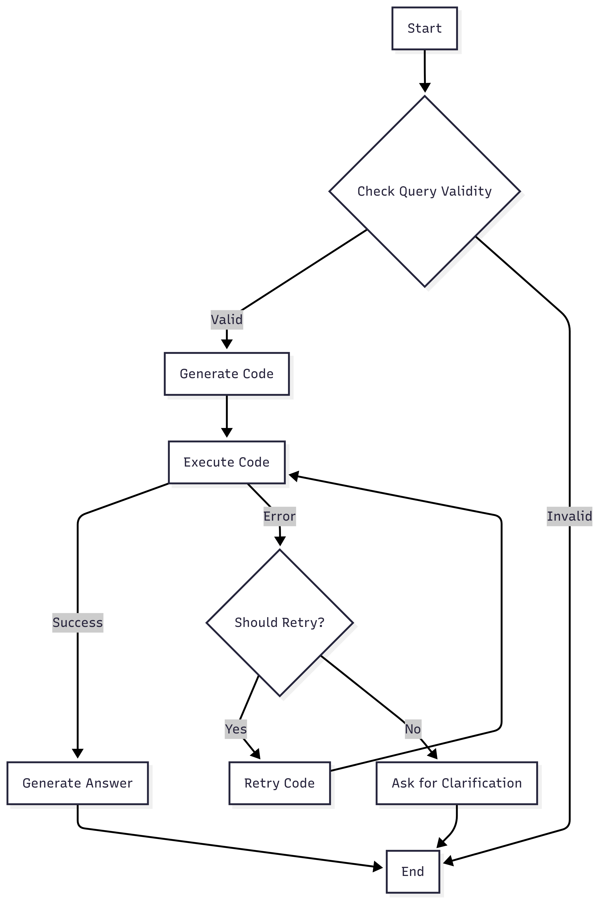

# 📊 Excel Chat Assistant

The Excel Chat Assistant is a powerful and intuitive Streamlit application that allows you to interact with your Excel files using natural language. Upload your data, and start asking questions. The assistant will analyze your data and provide you with answers, data visualizations, and insights.


## ✨ Features

*   **Natural Language Interaction**: Ask questions about your data in plain English.
*   **Multiple LLM Providers**: Choose from a variety of LLM providers, including Groq, OpenAI, Google Gemini, and Together AI.
*   **Multiple File Upload**: Upload and analyze multiple Excel files at once.
*   **Data Summary**: Get a comprehensive summary of your data, including column statistics and data types.
*   **Code Generation**: The assistant generates Python code to perform data analysis, which you can inspect.
*   **Error Handling and Retry**: The system can automatically retry and fix code generation errors.
*   **Chat History Export**: Export your chat history for future reference.

## 🛠️ Tech Stack

*   **Core Language**: Python
*   **Web Framework**: Streamlit
*   **Data Manipulation**: Pandas
*   **LLM Framework**: LangChain
*   **Agent/Workflow Engine**: LangGraph
*   **LLM Providers**: Groq, OpenAI, Google Gemini, Together AI
*   **Package Management**: uv

## 🏗️ System Architecture

The application is built with a modular architecture that separates the user interface, data handling, and core logic.

*   **Streamlit UI**: The user interface is built with Streamlit, providing a simple and interactive web-based experience.
*   **Data Manager**: The `DataManager` class is responsible for loading, processing, and managing the Excel data using the pandas library.
*   **LLM Setup**: The `llm_setup` module handles the initialization of the language model from the selected provider.
*   **Chat Workflow (LangGraph)**: The core logic is powered by a state machine built with LangGraph. This workflow manages the entire chat process, from understanding the user's query to generating and executing code, and finally providing an answer.

## ⚙️ How it Works

The application follows a structured workflow to answer your questions:

1.  **Initialization**: The Streamlit application initializes the session state and sets up the UI.
2.  **LLM Configuration**: You select an LLM provider and enter your API key to initialize the language model.
3.  **File Upload**: You upload one or more Excel files, which are loaded into pandas DataFrames by the `DataManager`.
4.  **Data Summary**: A summary is generated for each DataFrame, giving you an overview of your data.
5.  **Chat Interaction**: You ask a question in the chat.
6.  **LangGraph Workflow**: Your query is processed by the LangGraph state machine:
    *   **Query Validity Check**: The system first checks if your query is relevant to the loaded data.
    *   **Code Generation**: If the query is valid, the LLM generates Python code to analyze the data.
    *   **Code Execution**: The generated code is executed in a safe environment.
    *   **Retry Mechanism**: If there's an error in the code, the system attempts to fix it and re-execute.
    *   **Answer Generation**: Based on the execution result, the LLM generates a user-friendly answer.
    *   **Clarification**: If the system can't resolve an error, it will ask you for clarification.

### Chat Workflow Diagram



## 🚀 Setup and Installation

To run the Excel Chat Assistant locally, follow these steps:

### Prerequisites

*   Python 3.13 or higher
*   `uv` for package installation

### 1. Clone the Repository

```bash
git clone https://github.com/yashpaddalwar/excel-chat-app.git
cd excel-chat-app
```

### 2. Create a Virtual Environment and Install Dependencies

This project uses `uv` for package management.

```bash
# Create a virtual environment
uv venv

# Activate the virtual environment
# On Windows
.venv\Scripts\activate
# On macOS/Linux
source .venv/bin/activate

# Install dependencies from requirements.txt
uv add requirements.txt
```

### 3. Set Up API Keys

The application requires an API key for the LLM provider you choose. You will be prompted to enter the API key in the application's sidebar.

### 4. Run the Application

Start the Streamlit application with the following command:

```bash
streamlit run app.py
```

The application will open in your web browser.

## 📖 Usage

1.  **Configure LLM**: In the sidebar, select your preferred LLM provider and enter your API key. Click "Initialize LLM".
2.  **Upload Files**: Upload one or more Excel files using the file uploader in the sidebar.
3.  **Load Files**: Click the "Load Files" button to process the uploaded files.
4.  **Chat**: Once the files are loaded, you can start asking questions about your data in the chat input box.

##  walkthrough

Here's a brief overview of the project's structure and key files:

*   **`app.py`**: The main entry point of the Streamlit application. It initializes the session state and sets up the UI.
*   **`excel_chat_app/`**: The main application package.
    *   **`ui/`**: Contains the Streamlit UI components.
        *   `sidebar.py`: Defines the sidebar layout and functionality.
        *   `main_content.py`: Defines the main content area, including the chat interface.
    *   **`core/`**: Contains the core application logic.
        *   `data_handler.py`: The `DataManager` class for handling Excel data.
        *   `llm_setup.py`: The `setup_llm` function for initializing the language model.
        *   `chat_workflow.py`: The `ChatWorkflow` class, which defines the LangGraph state machine for the chat logic.
    *   **`config.py`**: Contains the prompts used to guide the LLM's behavior.
    *   **`logger_config.py`**: Configures the application's logger.
*   **`requirements.txt`**: A list of the Python packages required for the project.

## 🧠 Challenges and Solutions

*   **Complex Queries**: Handling complex, multi-step queries can be difficult. The LangGraph state machine helps break down the problem into smaller, manageable steps.

## 👨‍💻 About the Author

This application was built by **Yash Paddalwar**.

*   **GitHub**: [https://github.com/yashpaddalwar](https://github.com/yashpaddalwar)
*   **LinkedIn**: [https://linkedin.com/in/yashpaddalwar](https://linkedin.com/in/yashpaddalwar)
